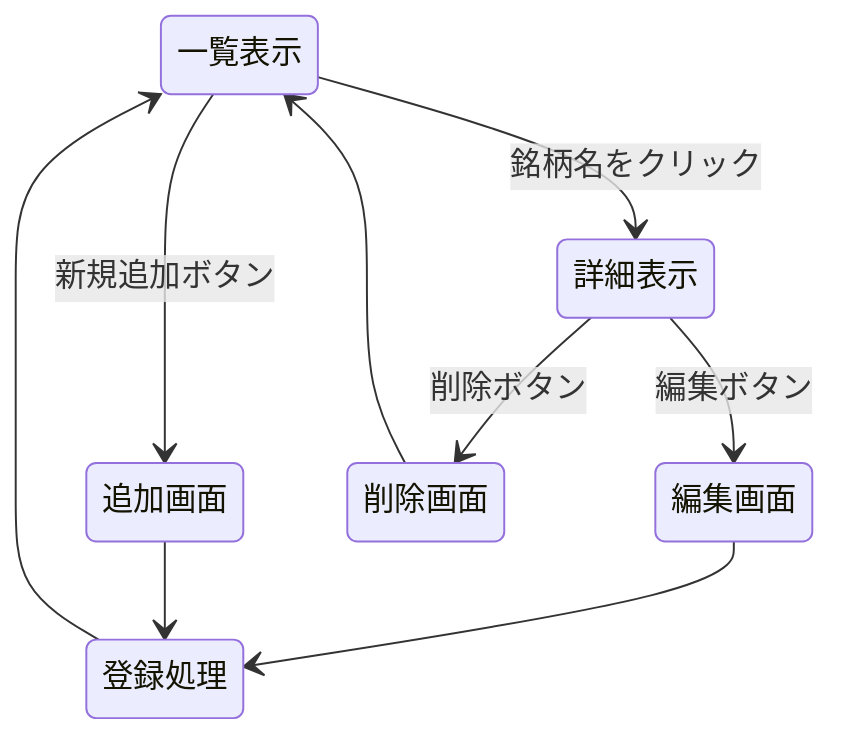

# 開発者用仕様書（案）

## 対象システム一覧
1. 持っている株の管理システム
2. イタリア料理システム
3. 人気曲システム

---

## 1. データ構造案

### (1) 持っている株の管理システム
変数名: `stocks`

| 項目 | 変数名 | 型 | 備考 |
| - | - | - | - |
| ID | `id` | int | 自動採番 |
| 銘柄名 | `name` | string | 例: Apple |
| 証券コード | `code` | string | 例: 1111 |
| 保有株数 | `amount` | int | |
| 取得単価 | `price` | int | 円（K）または，ドル |

### (2) イタリア料理システム
変数名: `dishes`

| 項目 | 変数名 | 型 | 備考 |
| - | - | - | - |
| ID | `id` | int | |
| 料理名 | `name` | string | 例: マルゲリータとか書く |
| 種類 | `type` | string | Pasta, Pizza, Main など |
| 価格 | `price` | int | |

### (3) 人気曲システム
変数名: `songs`

| 項目 | 変数名 | 型 | 備考 |
| - | - | - | - |
| ID | `id` | int | |
| 曲名 | `title` | string | |
| アーティスト | `artist` | string | |
| ランク/投票数 | `rank` | int | |

---

## 2. ページ遷移図（共通イメージ）

